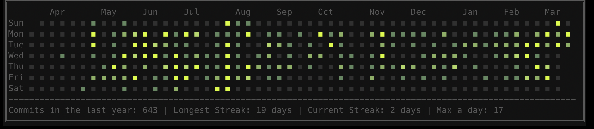
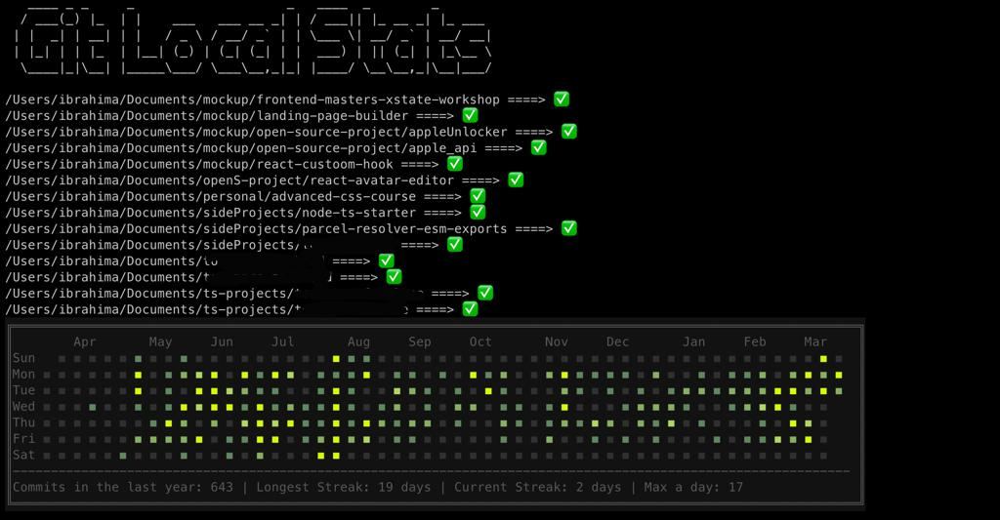

# Git Local Stats 📆



**git-local-stats** is an CLI tool that allows you to visual all your local git contributions.I found it useful because not all my projects were (are) on GitHub, some are on BitBucket or GitLab, but all the code I work on is on my laptop, so that’s the **single source of truth** when it comes to contributions.

## How it's work ??

**git-local-stats** take as argument a directory location and contributor name, scan for .git folders in there and in all subdirectories, and aggregates all the commits made by the contributor to finally display the stats as a calendar.


## Install 📥

`via NPM`

```bash
npm i -g  git-local-stats
```

`via YARN`

```bash
yarn add -g git-local-stats
```

`via PNPM`

```bash
pnpm i -g git-local-stats
```

## Usage 💡

**numberCommit** flag is optionnel

```bash
git-local-stats --help
git-local-stats --path <directory_path> --author <contributor_name> --numberCommit 1000
```

## Development

Build and install locally

- change **_install_** script inside `packgage.json` by providing valid **path** and **contributor name**

```bash
npm run install
```

Build

```bash
npm run build
```

## License 🎫

This project is released under the **[MIT License](LICENSE)** ✔
